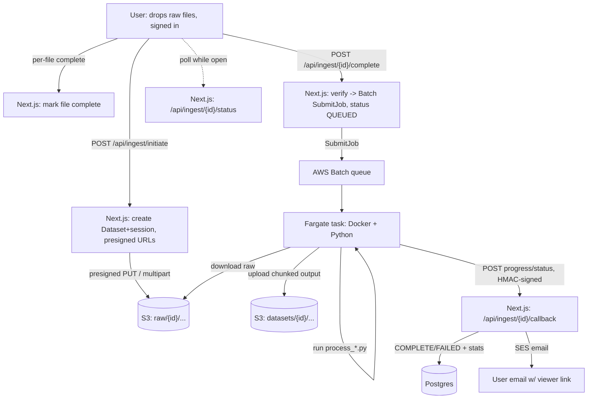

# Server-Side Dataset Ingestion

> Status: **✅ Shipped — live in production.** This is the "Upload & process on
> server" path on the homepage: the user uploads **raw** files, a background AWS
> Batch worker runs the Python processors, uploads the chunked output to S3,
> records it in Postgres, and emails the user a link.
>
> This document describes the system **as built**. It replaces the original
> design doc; the per-phase build docs below are kept as historical detail and
> the AWS setup checklist is still the source of truth for provisioning.
>
> **Diagrams:** [`flow.mermaid`](flow.mermaid) · [`sequence.mermaid`](sequence.mermaid)
> **Phase/build docs:** [Phase 0 — Schema](phase-0-schema.md) ·
> [Phase 1 — Raw upload](phase-1-raw-upload.md) ·
> [Phase 2 — Worker container](phase-2-worker-container.md) ·
> [Phase 3 — Trigger + callback + progress](phase-3-trigger-callback-progress.md) ·
> [Phase 3 — AWS setup checklist](phase-3-aws-setup.md) ·
> [Phase 4 — Polish](phase-4-polish.md) · [Later — optional stages](phase-later-optional-stages.md)
> **Benchmarks:** [benchmarks/](benchmarks/README.md)

---

## 1. What it is

The default drag-and-drop path parses data **in the browser** (h5wasm, hyparquet,
web workers), which is bounded by browser RAM/CPU. Server-side ingestion is a
**complementary** path for large datasets: the browser uploads the **raw bytes**
and a server-side worker runs
[`scripts/process_spatial_data.py`](../../scripts/process_spatial_data.py) or
[`scripts/process_single_molecule.py`](../../scripts/process_single_molecule.py)
to produce the canonical chunked format — the same format the viewer already reads
for pre-chunked datasets.

**Why:** no browser limits, and a single code path (the Python) for the chunked
format instead of parallel TS + Python implementations that can drift.

The Python **cannot** run inside the Next.js app (Vercel functions cap at
60–300s with an ephemeral filesystem). The app's role is: accept the upload →
record it → **trigger** the external worker → serve the results. AWS Batch
provides the queue, retries, and job tracking.

---

## 2. Architecture



**Status lifecycle:** `UPLOADING` → `QUEUED` → `PROCESSING` → `COMPLETE` | `FAILED`.
The app sets `QUEUED` when it submits the Batch job; the worker posts `PROCESSING`,
then `COMPLETE` or `FAILED` via the callback.

---

## 3. Client — the "Upload & process on server" path

- A toggle on the homepage drop zone switches between **Preview in browser** and
  **Upload & process on server**. Server mode does **no parsing** in the browser —
  it reads the file list and uploads bytes.
- **Gated behind sign-in** (Google / NextAuth). The notification email comes from
  the session, not a form.
- A picked folder is **filtered to the files the processor actually reads**
  ([`lib/ingest/classify-folder.ts`](../../lib/ingest/classify-folder.ts)) — a
  Xenium export is mostly images and QC artifacts, so uploading it whole would
  send gigabytes nothing opens. The classifier also detects whether the folder is
  single-cell, single-molecule, or **both** (a single-cell folder containing a
  transcripts file offers a combined upload → two datasets + an auto-created
  project).
- **Single-molecule uploads add a mandatory "Confirm columns" step** (§6).
- **Upload overlay**: a full-screen blocking overlay with an aggregate byte
  counter and a leave-guard (`beforeunload` + in-app navigation intercept). Once
  the bytes are up the dataset is `QUEUED` and the user is free to leave;
  processing continues server-side.

### Raw upload

- Raw objects land at `raw/{datasetId}/{relativePath}`.
- Small files use presigned single-PUT; **files above ~100 MB use S3 multipart**
  (`CreateMultipartUpload` → presigned `UploadPart` → `CompleteMultipartUpload`,
  helpers in [`lib/s3.ts`](../../lib/s3.ts)), uploaded with limited concurrency and
  per-part retry. `upload.onprogress` (via `XMLHttpRequest`) drives the byte
  counter; `fetch()` exposes no upload progress.
- `UploadFile` rows track each raw object.

---

## 4. API routes

All under `/api/ingest`. They mirror the existing `datasets/*` shape.

| Route | Method | Purpose |
|---|---|---|
| `/api/ingest/initiate` | POST | Create `Dataset` (`UPLOADING`, `ownerId` from session), `UploadSession`, `UploadFile[]`; return presigned upload URLs (single or multipart). |
| `/api/ingest/[id]/files/[key]/complete` | POST | Mark a raw file complete. |
| `/api/ingest/[id]/complete` | POST | Verify all raw files uploaded → set `QUEUED` → **`SubmitJob`** to AWS Batch with the dataset id, kind, and processing params. |
| `/api/ingest/[id]/callback` | POST | **Worker → app**, HMAC-authed (§7). Sets `PROCESSING`/`COMPLETE`/`FAILED`, writes progress, stores stats + manifest key + fingerprint, sends the SES email, registers the produced output file. |
| `/api/ingest/[id]/status` | GET | Status + progress for the client to poll while the tab is open, and for the admin dashboard. |
| `/api/ingest/[id]/abort` | POST | Cancel an in-flight upload: `AbortMultipartUpload`, delete uploaded `raw/{id}/` objects, mark the dataset aborted. |
| `/api/ingest/mine`, `/api/ingest/mine/[id]` | GET | The signed-in user's in-flight / recent server uploads. |

The app authenticates to AWS Batch with the `merfisheyes-staging-vercel` IAM user
(`batch:SubmitJob/DescribeJobs/TerminateJob`), via `@aws-sdk/client-batch`.

---

## 5. The worker

Source: [`worker/Dockerfile`](../../worker/Dockerfile) +
[`worker/entrypoint.py`](../../worker/entrypoint.py). The image is
`python:3.12-slim` + `anndata, numpy, pandas, scipy, pyarrow` + the two
`scripts/process_*.py` files **copied in verbatim** + the entrypoint. It runs on
**AWS Batch (Fargate)**.

`entrypoint.py` does:

1. Read job env: `DATASET_ID`, `DATASET_KIND` (`single_cell` | `single_molecule`),
   `PROCESSING_PARAMS` (JSON), `AWS_S3_BUCKET`, `AWS_REGION`, `CALLBACK_URL`,
   `CALLBACK_SECRET`, `VERCEL_BYPASS_SECRET`, `DELETE_RAW`, `UPLOAD_CONCURRENCY`.
2. `POST callback status=PROCESSING`.
3. Download `raw/{id}/` from S3 into Fargate ephemeral scratch.
4. **Compute a raw-content fingerprint** — SHA-256 streamed over the raw bytes
   (path + size folded in), before anything mutates the input (§8).
5. Run the processor for the kind:
   - **single-cell** → move the annotation CSV out of the input tree if one was
     supplied (§5.1), then `process_spatial_data.py <input> out/` (auto-detects
     h5ad/Xenium/MERSCOPE), with `--chunk-size` and optional `--mmc-csv`.
   - **single-molecule** → `process_single_molecule.py <input> out/` with an
     explicit column mapping when the UI provided one, else auto-detection (§6).
   While the processor runs, its `STEP`/`[n/total]` log lines are parsed into
   staged progress and posted to the callback (throttled).
6. Clear any stale `datasets/{id}/` objects, then upload `out/` there
   (concurrent; per-gene output is thousands of tiny objects).
7. If `DELETE_RAW=true`, delete `raw/{id}/`. **In production `DELETE_RAW=false`**,
   so raw is kept and expires via the S3 lifecycle rule (§9) — a failed job can be
   retried without re-uploading.
8. `POST callback status=COMPLETE` with `manifestKey`, `uploadedFiles`,
   `fingerprint`, and `stats` (cells/genes or molecules/genes, dims). On any error:
   `POST callback status=FAILED` with the processor's own error message.

### 5.1 Cell-type annotation is the user's CSV, not a server step

There is **no server-side MapMyCells**. The user runs MapMyCells (or anything)
themselves and uploads a one-row-per-cell CSV under a reserved key.
`stages.chunk.mmcCsv` names it; the worker moves it **out of the raw input tree**
before processing (a MERSCOPE input dir is scanned for metadata / cell-by-gene
CSVs, so a stray CSV there invites a misdetection) and passes it as `--mmc-csv`.
The merge happens before the expensive steps, so the annotation column gets a
palette and DE stats like any other cluster column. If the row count doesn't match
the cell count, the processor fails with a specific message ("CSV has N rows but
dataset has M cells") that propagates to the dataset's error and the overlay.

---

## 6. Processing parameters & the column-confirm step

`Dataset.processingParams` is a JSON blob carrying the processor intent:

```jsonc
{
  "kind": "single_cell",
  "stages": {
    "chunk": {
      "chunkSize": 1,                          // genes per chunk; 1 = one file per gene
      "mmcCsv": "__annotations__/mapping.csv"  // optional annotation CSV key
    }
  },
  "linkedSmDatasetId": "sm_..."                // combined upload: link cells -> molecules
}
```

For **single-molecule**, the params instead carry a `columnMapping`:

```jsonc
{ "kind": "single_molecule",
  "columnMapping": { "gene": "feature_name", "x": "x_location",
                     "y": "y_location", "z": "z_location", "cellId": "cell_id" } }
```

**The column-confirm step** is the main net-new UX surface. On a single-molecule
server upload the browser reads just enough of the file to preview it —
`hyparquet` reads only the parquet **footer** (schema) and first rows; CSV reads
the header + a few rows via PapaParse — then shows a modal with the columns, a
few sample rows, and dropdowns pre-filled from the detected platform. The user
confirms or remaps gene / x / y / z / cell-id before the job is submitted.

In the worker: if `columnMapping` has gene+x+y, it runs
`process_single_molecule.py --dataset-type custom --gene-col … --x-col … --y-col …`
(plus `--z-col` / `--cell-id-col` when present). Otherwise it auto-detects the
schema from the header (`global_x` → MERSCOPE, `x_location` → Xenium). Unassigned
molecules are recognized across platforms — MERSCOPE `-1`, Xenium `UNASSIGNED`,
CosMx `0` — see [scripts/README.md](../../scripts/README.md).

---

## 7. Progress, status & the callback

- The worker **posts progress and terminal status to
  `/api/ingest/[id]/callback`**, signed with `x-ingest-signature: sha256=<HMAC>`
  of the raw body using `CALLBACK_SECRET`. When the target deployment has Vercel
  Deployment Protection, the worker also sends `x-vercel-protection-bypass`.
- Progress posts are **best-effort**: one attempt, no backoff, and the worker
  **stops sending them after 3 consecutive failures** (an unreachable callback URL
  would otherwise stretch a 2-minute job past 10 minutes). Terminal `COMPLETE` /
  `FAILED` posts are retried, because losing one strands the dataset.
- The callback writes progress onto the `Dataset`; **the client polls
  `/api/ingest/[id]/status`** while the tab is open (this is a callback + polling
  model — Supabase Realtime was considered in the original design but is not used).
- Full logs stay in **CloudWatch**.

**Why a callback, not a direct DB write:** it keeps Postgres credentials and the
SES send inside the app. The worker only needs S3 + outbound HTTPS + the shared
secret; it never touches Postgres.

---

## 8. Email, failures & the admin dashboard

- On `COMPLETE`, the callback sends the "your dataset is ready" email via **AWS
  SES** ([`lib/ses.ts`](../../lib/ses.ts)) with the `/viewer/{id}` or
  `/sm-viewer/{id}` link.
- On `FAILED`, [`lib/ingest/mark-failed.ts`](../../lib/ingest/mark-failed.ts) sets
  the status, stores `errorMessage`, classifies the failure
  ([`lib/ingest/error-classification.ts`](../../lib/ingest/error-classification.ts):
  USER / PLATFORM / UNKNOWN, e.g. OOM, timeout, lost job, missing column) into
  `faultCategory`, and emails the owner the raw error plus a hint. A reconcile path
  also marks jobs that die without ever calling back.
- The **admin processing dashboard** (`/admin/dashboard`, backed by
  `/api/admin/processing`) shows dataset/upload stats, recent activity, and
  failures with their auto-classified fault label (admins can re-tag).

---

## 9. Deduplication

The pre-server fingerprint was computed **client-side from processed data**, which
we no longer have at upload time. As shipped, **the worker computes a raw-content
fingerprint** (§5 step 4) and returns it in the `COMPLETE` callback; the app dedups
on the `Dataset.fingerprint` `@unique` column. Re-uploading identical file(s)
reproduces the same digest.

> **Known gap:** this raw fingerprint is *not* the same value the browser path
> computes from processed data, so a dataset uploaded both ways won't be detected
> as a duplicate across paths. Reconciling the two is deferred.

---

## 10. Database fields

Added to support ingestion (see [`prisma/schema.prisma`](../../prisma/schema.prisma)):

- `Dataset.ownerId` (FK to `User`), `processingParams` (Json), `processingProgress`
  (Json, live stage/%), `batchJobId`, `errorMessage`, `faultCategory`
  (`USER|PLATFORM|UNKNOWN`), and `completedAt`.
- `DatasetStatus` gained **`QUEUED`** (raw uploaded, Batch job submitted, not yet
  running).
- `numCells` doubles as the molecule count for single-molecule datasets.

Migrations run via the existing `safe-migrate` build step.

---

## 11. AWS infrastructure (as provisioned)

Account **533267148861**, region **us-west-2** (must match the S3 bucket to avoid
cross-region transfer). Step-by-step provisioning is in
[phase-3-aws-setup.md](phase-3-aws-setup.md).

| Resource | Value |
|---|---|
| ECR repo | `…/merfisheyes-worker:latest` (linux/amd64, ~214 MB) |
| Batch compute env | `merfisheyes-fargate` (FARGATE, maxvCpus 64) |
| Batch job queue | `merfisheyes-ingest` |
| Batch job definition | `merfisheyes-ingest` — 4 vCPU / 16384 MB, 100 GiB ephemeral, `assignPublicIp: ENABLED`, retry 2 |
| Execution role | `merfisheyes-batch-execution` (ECS task execution) |
| Task role | `merfisheyes-batch-task` — S3 RW on the dataset bucket |
| Dataset bucket | `merfisheyes-staging` — `raw/{id}/`, `datasets/{id}/` |
| S3 lifecycle | `expire-raw-ingest` — `raw/` expires after 7 days; aborts incomplete multipart after 1 day |
| Networking | default VPC, public subnets + `assignPublicIp` (no NAT gateway) |

**Job env:** static values on the job definition (`AWS_S3_BUCKET`, `AWS_REGION`,
`UPLOAD_CONCURRENCY=16`, `DELETE_RAW=false`); per-job values come from `SubmitJob`
overrides (`DATASET_ID`, `DATASET_KIND`, `PROCESSING_PARAMS`, `CALLBACK_URL`,
`CALLBACK_SECRET`, `VERCEL_BYPASS_SECRET`). **No static AWS keys in the job** — the
task role provides credentials and boto3 picks them up.

The job definition's 16 GB comfortably clears the worst measured peak (~4.3 GB, a
1.2 GB MERSCOPE input — MERSCOPE sets the memory ceiling, not the largest h5ad).
See [benchmarks/](benchmarks/README.md).

---

## 12. Deploying a worker code change

`worker/Dockerfile` copies `scripts/process_*.py` and `entrypoint.py` **into the
image**, so an edit to those files reaches Fargate **only via an ECR rebuild +
push** — nothing reads them from the repo at runtime. There is a single shared
`:latest` tag; the Batch job definition points at it.

```bash
REPO=<acct>.dkr.ecr.us-west-2.amazonaws.com
aws ecr get-login-password --profile merfisheyes-admin --region us-west-2 \
  | docker login --username AWS --password-stdin "$REPO"
docker build --platform linux/amd64 -f worker/Dockerfile -t "$REPO/merfisheyes-worker:latest" .
docker push "$REPO/merfisheyes-worker:latest"
```

Fargate pulls `:latest` at task start, so the next job runs the new code. Admin
work (ECR/Batch/IAM) uses the `merfisheyes-admin` CLI profile — the app's S3-only
profiles can't touch it.

---

## 13. Cost

Fargate scales to zero — you pay per job. A typical small job (4 vCPU/16 GB,
~2 min including ~40 s Fargate startup) is ≈ **$0.01–0.02**. Roughly 500 jobs/month
is on the order of **~$10** of compute, plus small ECR/CloudWatch/transfer costs.
**Upload is the bottleneck, not processing** (see benchmarks).

---

## 14. Not built / future

- **QC stage** — the pipeline is structured for ordered, chained stages (the
  `stages` shape in §6); a QC stage (n_genes, total_counts, pct_mito, doublet
  score → numerical obs columns + a report artifact, optionally a filter mask)
  can slot in as a chained Batch job with no rework. Not built.
- **Per-user compute tiers** — the schema and SubmitJob path can size vCPU/RAM per
  uploader; today a single fixed job definition (4 vCPU/16 GB) is used for all.
- **Cross-path dedup** — reconciling the raw fingerprint with the browser's
  processed fingerprint (§9).
