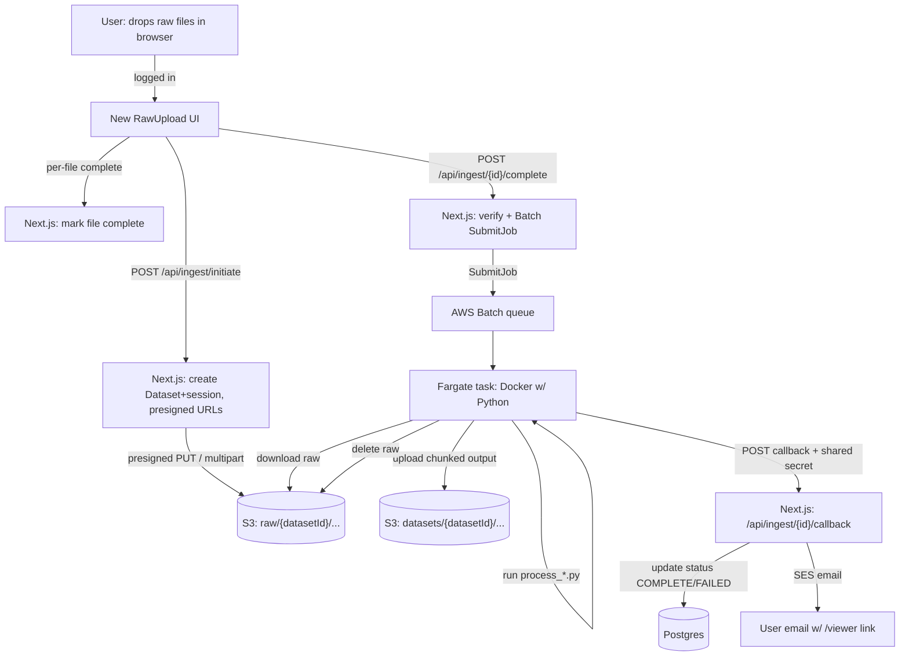

# Server-Side Dataset Ingestion — Design Doc

> Status: **DRAFT for review**. No code written yet. This describes a new,
> *complementary* drag-and-drop path where the user uploads **raw** data, a
> background AWS worker runs the existing Python processors, uploads the
> processed output to S3, records it in the DB, and emails the user a link.
>
> **Diagrams:** [`flow.mermaid`](flow.mermaid) (data flow) ·
> [`sequence.mermaid`](sequence.mermaid) (temporal sequence).
>
> **Phase docs:** [Phase 0 — Schema](phase-0-schema.md) ·
> [Phase 1 — Raw upload](phase-1-raw-upload.md) ·
> [Phase 2 — Worker container](phase-2-worker-container.md) ·
> [Phase 3 — Trigger + callback + progress](phase-3-trigger-callback-progress.md) ·
> [Phase 4 — Polish](phase-4-polish.md) ·
> [Later — Optional stages](phase-later-optional-stages.md)

---

## 1. Goal

Today, drag-and-drop in the browser parses data **client-side** (h5wasm, hyparquet,
web workers). This is limited by browser RAM and CPU — large datasets (500K+ cells,
20M+ molecules, multi-GB files) either fail or degrade badly.

We want a second path: the user drops raw files, we **upload the raw bytes**, and a
**server-side worker** runs [`scripts/process_spatial_data.py`](../scripts/process_spatial_data.py)
or [`scripts/process_single_molecule.py`](../scripts/process_single_molecule.py) to
produce the canonical chunked format, then stores + serves it exactly like today's
pre-chunked datasets.

**Wins:** no browser limits, and full control/standardization over how the chunked
format is produced (one code path — the Python — instead of parallel TS + Python
implementations that can drift).

---

## 2. Decisions locked in

| Decision | Choice |
|---|---|
| Compute for the Python worker | **ECS Fargate via AWS Batch** |
| Existing AWS | Only S3 + SES today; worker infra is **greenfield** |
| Database | **Supabase Postgres** (public over TLS; reachable from Fargate) |
| Who can upload | **Logged-in users only** (Google OAuth, NextAuth v5) |
| Dataset ownership | Add `ownerId` → future per-user dashboard |
| Per-user compute | Add `User.computeTier` → job vCPU/RAM sized per uploader |
| Raw files after processing | **Deleted** on success + S3 lifecycle rule as backstop |
| Progress feedback | **Fine-grained, live** — worker → Supabase Realtime (GitHub-Actions style) |
| Processing pipeline | **v1 = `process_spatial_data.py` only**; architected as extensible stages (§5.8) |
| MapMyCells / QC | **Future opt-in stages**, within the default `computeTier` — not built in v1 |
| Delivery of this pass | This design doc first |

---

## 3. Constraints that shaped the design

- **App runs on Vercel serverless** — functions cap at 60–300s and limited RAM with
  an ephemeral filesystem. The Python **cannot run inside the Next.js app**. The app's
  role is: accept upload → record → **trigger** the external worker → serve results.
- **Raw uploads are multi-file and large.** Xenium/MERSCOPE are *folders* (many CSVs);
  h5ad/parquet/csv are single files that can be multi-GB. The current upload helper
  (`lib/s3.ts`) only does **single-PUT** presigned uploads (S3 single-PUT practical
  limit ~5 GB). Large raw files need **multipart upload** — a new addition.
- **No background-job infra exists** — no SQS/Redis/BullMQ/queue. AWS Batch provides
  the queue, retries, and job tracking, so we don't add our own for v1.

---

## 4. High-level architecture



Status lifecycle: `UPLOADING` → `QUEUED` → `PROCESSING` → `COMPLETE` | `FAILED`.

---

## 5. Component breakdown

### 5.1 Client — new "process on server" drop zone

- A **separate, simpler** path from the existing local-processing drag-drop. The
  browser does **no parsing** — it only reads the file list and uploads bytes.
- Gated behind auth; the notify email comes from the **session** (no email form).
- Collects the file tree (single file, or a folder for Xenium/MERSCOPE, preserving
  relative paths).
- **Processing parameters** (see §7) collected here when needed (dataset type /
  column mapping for single-molecule).
- UX: either a toggle on the existing drop zone ("Process in browser" vs "Upload &
  process on server") or a distinct upload button. TBD in build.

### 5.2 Raw upload path

- Raw objects land at `raw/{datasetId}/{relativePath}`.
- Small files: reuse presigned single-PUT.
- **Large files (> ~100 MB): multipart upload** — new helpers in `lib/s3.ts`:
  `CreateMultipartUpload` → presigned `UploadPart` URLs → `CompleteMultipartUpload`.
  Client uploads parts in parallel and reports completion.
- `UploadFile` rows track each raw object (reuse existing model).

### 5.3 API routes (new, mirror existing `datasets/*` shape)

| Route | Method | Purpose |
|---|---|---|
| `/api/ingest/initiate` | POST | Create `Dataset` (status `UPLOADING`, `ownerId` from session), `UploadSession`, `UploadFile[]`; return presigned upload URLs (single or multipart). |
| `/api/ingest/[id]/files/[key]/complete` | POST | Mark a raw file `COMPLETE`, increment `completedFiles`. |
| `/api/ingest/[id]/complete` | POST | Verify all raw files uploaded → set `QUEUED` → **`SubmitJob`** to AWS Batch, **sizing vCPU/RAM from the uploader's `computeTier`** (§5.6), with dataset id + processing params. |
| `/api/ingest/[id]/callback` | POST | **Worker → app** callback (shared-secret/HMAC auth). Sets `PROCESSING`/`COMPLETE`/`FAILED`, writes progress (§5.5), stores stats + manifest URL, triggers SES email. |
| `/api/ingest/[id]/status` | GET | Status fallback for non-Realtime clients / the dashboard. |
| `/api/ingest/[id]/abort` | POST | Cancel an in-flight upload: `AbortMultipartUpload`, delete uploaded `raw/{id}/` objects, mark `Dataset` aborted/deleted (§10). |

The app authenticates to AWS Batch with the existing IAM creds (new
`@aws-sdk/client-batch` dependency).

### 5.4 The worker (Docker image on Fargate)

Container includes Python + deps (`anndata`, `numpy`, `pandas`, `scipy`, `pyarrow`)
and the two `scripts/process_*.py` files. Entrypoint (a thin Python/shell wrapper):

1. Read job env: `DATASET_ID`, `DATASET_KIND` (`single_cell` | `single_molecule`),
   processing params, `CALLBACK_URL`, `CALLBACK_SECRET`.
2. `POST callback status=PROCESSING`.
3. Download `raw/{datasetId}/` from S3 to local scratch (Fargate ephemeral storage,
   sized for raw + output — configurable up to 200 GB).
4. Run the enabled processing stages (§5.8) — **v1 is a single stage**:
   - single-cell → `process_spatial_data.py raw/ out/` (auto-detects h5ad/xenium/merscope)
   - single-molecule → `process_single_molecule.py raw_file out/ [--dataset-type ...]`
5. Upload `out/` to `datasets/{datasetId}/` in S3 (same layout the viewer already
   reads via `ChunkedDataAdapter` / `SingleMoleculeDataset.fromS3()`).
6. Delete `raw/{datasetId}/` from S3.
7. `POST callback status=COMPLETE` with stats (cells, genes, dims, manifest key).
8. On any error: `POST callback status=FAILED` with the error message. Batch retries
   per the job definition; final failure surfaces to the DB + (optionally) an email.

**Why a callback instead of the worker writing Postgres directly:** keeps DB
credentials and the SES send in the app (reuse existing email routes), so the worker
only needs S3 + outbound HTTPS + a shared secret. (Direct DB write is a viable
alternative if we'd rather not expose a callback endpoint — noted in §9.)

### 5.5 Live progress (GitHub-Actions style)

Processing is modeled as **discrete stages**, each with a status and (for long stages)
a coarse `%`:

```
Queued → Reading file → Coordinates → Expression chunks → DE stats → Uploading → Done
```

- The Python scripts already log staged progress (`STEP 4.5`, `chunk 3/10`, …). The
  worker entrypoint maps those to stage transitions and POSTs them to the callback.
- The callback writes a `processingProgress` JSON onto the `Dataset`.
- **Supabase Realtime**: the browser subscribes to the `datasets` row (or a dedicated
  progress table) and receives live updates — no polling. `/api/ingest/[id]/status`
  remains as a fallback.
- Full raw logs stay in **CloudWatch**, surfaced as an expandable "view log" like a
  GitHub Actions step.

### 5.6 Per-user compute tier

`SubmitJob` **overrides vCPU/RAM per job** from the uploader's `User.computeTier`
(e.g. `standard` = 4 vCPU/16 GB, `large` = 8/32, `xlarge` = 16/64). Fargate has fixed
valid CPU↔RAM pairs (4 vCPU → 8–30 GB, up to 16 vCPU/120 GB), so tiers snap to allowed
combos. Optionally route tiers to separate Batch **job queues** with different priority.

### 5.7 Email

Reuse the existing SES routes (`/api/send-email`, `/api/send-email-single-molecule`).
The callback handler calls them (or the same SES helper) once status flips to
`COMPLETE`, sending the `/viewer/{id}` or `/sm-viewer/{id}` link.

### 5.8 Extensible processing pipeline (v1 = chunk only)

**v1 runs a single stage** — `process_spatial_data.py` (chunking). But the worker is
structured as an ordered **stage pipeline** so MapMyCells annotation and QC slot in
later with **no rework**. This mirrors the BIL SLURM chain
(`combine → map_my_cell → process_spatial → sync`) but parameterized and *not* a 1:1
copy. Stages are declared in `Dataset.processingParams`:

```json
{
  "kind": "single_cell",
  "stages": {
    "chunk": { "chunkSize": 1 }              // v1: the only enabled stage
    // chunkSize = GENES PER CHUNK (process_spatial_data.py --chunk-size).
    // 1 => one file per gene, so the viewer fetches only the selected gene
    // (fast gene switching) instead of a whole multi-gene chunk. Omit it to
    // let the script auto-determine (~200 genes/chunk) if you'd rather have
    // fewer, larger objects.
    // future, opt-in:
    // "annotate": { "tool": "mapmycells", "species": "mouse", "flatten": true },
    // "qc":       { "metrics": ["n_genes","total_counts","pct_mito"], "mask": "p65" }
  }
}
```

**Stage contract** (same way the BIL launcher threads scripts): each stage reads the
shared scratch dir, writes its output, and hands artifacts to the next stage via the
processor's existing flags — `annotate` → `mapping_output.csv` → `chunk --mmc-csv`;
`qc` → mask CSV → `chunk --mask`. Each stage posts its own progress step (§5.5).

**Execution:** v1 = **one Batch job** (chunk). When multi-stage is enabled later, submit
**chained Batch jobs** with `dependsOn` (the cloud equivalent of SLURM `afterok`), each
stage sized within our normal **`computeTier`** envelope — we deliberately do **not**
replicate BIL's 512 GB MapMyCells (that was spare-HPC headroom, not a requirement).

**Future — `annotate` (MapMyCells):** **opt-in per upload** with species select;
**single-cell only**, mouse/human taxonomy, needs raw counts; Xenium's native layout
needs an adapter. Reference taxonomy files mounted from S3/EFS via
`MERFISHEYES_REFERENCE_DIR` (the script already reads that env var).

**Future — `qc`:** emits QC obs columns (n_genes, total_counts, pct_mito, doublet score)
that flow into the chunked output as numerical columns, a QC report artifact (PNG/HTML)
to S3 for the dashboard, and optionally a filter mask via the existing `--mask` path
(the BIL artifact-mask mechanism is the template).

---

## 6. Database changes

```prisma
model Dataset {
  // ... existing fields ...
  ownerId          String? @map("owner_id")            // NEW: FK to User
  owner            User?   @relation(fields: [ownerId], references: [id], onDelete: SetNull)
  ingestSource     String? @map("ingest_source")       // NEW: "browser" | "server" (optional)
  batchJobId       String? @map("batch_job_id")        // NEW: AWS Batch job id for tracing
  processingParams Json?   @map("processing_params")   // NEW: dataset type / column mappings
  processingProgress Json? @map("processing_progress") // NEW: live stage/% for Realtime
  @@index([ownerId])                                   // NEW: for the user dashboard
}

model User {
  // ... existing fields ...
  computeTier String   @default("standard") @map("compute_tier") // NEW: job vCPU/RAM tier
  datasets    Dataset[]                                          // NEW: inverse relation
}

enum DatasetStatus {
  UPLOADING
  QUEUED       // NEW: raw uploaded, Batch job submitted, not yet running
  PROCESSING
  COMPLETE
  FAILED
}
```

- Migration via the existing `safe-migrate.js` build step.
- **Dedup / fingerprint** (independent of Supabase — the DB just stores the hash
  string): the current fingerprint is computed client-side from *processed* data, which
  we no longer have at upload time. **Resolved → the worker computes the canonical
  fingerprint post-processing and dedups then** — it matches today's format exactly.
  Tradeoff accepted: a duplicate is detected *after* the compute, not before.

---

## 7. Processing parameters — the "map your columns" step

The browser currently auto-detects format/columns. Server-side we pass that intent to
the Python explicitly, via a **mandatory column-mapping step** in the RawUpload UI.

- **Single-cell** (`process_spatial_data.py`): auto-detects h5ad/Xenium/MERSCOPE and
  coordinate/cluster columns already — likely **zero config** for most inputs.
- **Single-molecule** (`process_single_molecule.py`): needs `--dataset-type`
  (xenium/merscope/custom), the gene/x/y/z columns, and optional `--cell-id-col`.

**Column names are extracted client-side without uploading or fully parsing the file:**

- **CSV** — read the first chunk (`File.slice(0, ~64KB)`), parse the header row + a few
  sample rows for preview.
- **Parquet** — read only the **footer** (schema) via `hyparquet` (already a
  dependency) by slicing the **tail bytes**; gives column names ("keys") without
  touching the millions of data rows.

The UI shows detected columns, pre-fills sensible defaults (Xenium/MERSCOPE mappings),
and **requires an explicit "Continue" even when defaults already match** — that
confirmation is what enforces standardization before a job is submitted. This
column-confirm screen is the main net-new UX surface.

---

## 8. Infrastructure to provision (all greenfield)

One-time AWS setup (candidate for Terraform/CDK if we go "everything incl. worker"):

1. **ECR** repository for the worker image; CI builds & pushes it.
2. **Docker image** — Python 3.11 + `anndata, numpy, pandas, scipy, pyarrow` +
   `scripts/process_*.py` + entrypoint wrapper.
3. **AWS Batch on Fargate** — compute environment, job queue, job definition
   (vCPU/RAM configurable per job; ephemeral storage sized for large data).
4. **IAM roles:**
   - App role (Vercel creds): `batch:SubmitJob`, `batch:DescribeJobs`.
   - Job execution + task role: read/write the S3 bucket (raw + datasets prefixes),
     `logs:*` to CloudWatch. (SES stays in the app via the callback, so the worker
     needs no SES perms.)
5. **Networking** — VPC/subnets/security group for Fargate tasks with outbound
   internet (S3 + HTTPS callback). NAT or VPC endpoints for S3.
6. **S3 lifecycle rule** on `raw/` — expire objects after N days (backstop to the
   worker's explicit delete).
7. **Secrets** — `CALLBACK_SECRET` shared between app and worker.

---

## 9. Decisions

**Resolved:**

- **Dedup timing** → worker computes the canonical fingerprint **after** processing (§6).
- **Progress** → fine-grained staged progress, pushed live via **Supabase Realtime** (§5.5).
- **Per-user compute** → job vCPU/RAM sized from `User.computeTier`; `SubmitJob`
  overrides per job (§5.6).
- **IaC** → hand-provision for the v1 spike (documenting each step), convert to CDK
  once it works.

- **Worker → DB** → **callback API** (`/api/ingest/[id]/callback`, secret-authed).
  Keeps DB + SES logic in the app; worker never touches Postgres directly. Realtime
  progress works via the callback writing the row.
- **Multipart** → **enabled above 100 MB** (raw path only; existing small-chunk upload
  stays single-PUT). Part size 16–64 MB. Requires an S3 lifecycle rule to abort
  orphaned incomplete multipart uploads.
- **`computeTier`** → ship a **single default tier**, tune/add tiers from there.
- **Upload UX** → full §10 (all resolved).
- **Pipeline shape** → v1 runs **chunking only** (`process_spatial_data.py`), built as an
  extensible stage pipeline (§5.8). **MapMyCells** = future **opt-in** stage (single-cell,
  mouse/human, raw counts) sized to the default `computeTier`; **QC** = future stage.

---

## 10. First-time upload UX (raw upload phase)

Covers **only the browser → S3 upload**. Once it completes the user is free to leave;
server-side processing progress is separate (§5.5 / dashboard).

**Layout — full-screen blocking overlay**
- A full-screen overlay covers the app during upload; the user stays on the page and
  can't interact with anything behind it except **Cancel**.
- **Big blue progress bar** pinned at the top. Copy: *"Uploading your dataset — please
  don't close this tab."*
- **Aggregate byte counter** `xx MB / yy MB` summed across all files in the dataset
  (total known at initiate), plus **ETA** from a rolling average of bytes/sec (≈5 s
  window); shows *"Calculating…"* until enough samples. Optional current speed (MB/s).

**Progress source (technical)**
- `fetch()` exposes **no upload progress** → use **`XMLHttpRequest`** per presigned PUT
  for `upload.onprogress` byte events.
- **Multipart** (>100 MB files): aggregate = Σ(completed part bytes) + in-flight part's
  XHR progress; parts uploaded with limited concurrency (~3–4) and per-part retry.

**Close / leave guard** (registered only while an upload is in flight)
- **Real tab-close / refresh** → `beforeunload` fires the browser's **generic** native
  prompt (custom wording not possible — browser limitation).
- **In-app navigation** (router/link clicks) → intercepted → **custom modal**:
  *"Upload in progress. Leaving will cancel it. Leave anyway?"* (Stay / Leave).

**Completion**
- Overlay switches to *"✅ Uploaded — we'll email you when processing finishes"*; guards
  removed; user free to close/navigate. `Dataset` is `QUEUED`; processing runs server-side.

**Cancel + cleanup** (also the path the S3 lifecycle rule backstops on hard-close)
- Cancel aborts in-flight XHR(s) (`AbortController`), calls an abort endpoint →
  `AbortMultipartUpload` for any multipart, deletes uploaded objects under `raw/{id}/`,
  marks the `Dataset` aborted/deleted, and removes the guards.

**Failure**
- A part failing after retries surfaces an error state with **Retry / Cancel**; giving
  up runs the same cleanup.

---

## 11. Phased implementation plan

Each phase is its own doc (goal · tasks · files touched · verification · provisioning):

| Phase | Doc | One-liner | AWS/Supabase work? |
|---|---|---|---|
| 0 | [Schema & scaffolding](phase-0-schema.md) | Prisma fields + migration | No |
| 1 | [Raw upload](phase-1-raw-upload.md) | Ingest routes, multipart, drop-zone + overlay | No |
| 2 | [Worker container](phase-2-worker-container.md) | Dockerfile + entrypoint, run manually | Local Docker |
| 3 | [Trigger + callback + progress](phase-3-trigger-callback-progress.md) | SubmitJob, callback, Realtime, stand up Batch | **Yes** |
| 4 | [Polish](phase-4-polish.md) | Retries, logs, dashboard, tiers | Minor |
| — | [Later — optional stages](phase-later-optional-stages.md) | MapMyCells + QC as chained jobs | Later |

Build order is strict 0 → 1 → 2 → 3; Phase 2 can be developed in parallel with Phase 1.

---

## 12. Cost recap (approximate, on-demand, us-east-1, early 2026)

Fargate scales to zero; you pay per job. Typical job (4 vCPU/16 GB, ~5 min) ≈ **$0.02**;
large job (8 vCPU/32 GB, ~20 min) ≈ **$0.16**. ~500 jobs/month ≈ **~$10** compute, plus
a few dollars of ECR storage, CloudWatch logs, and data transfer. S3/SES as today.
