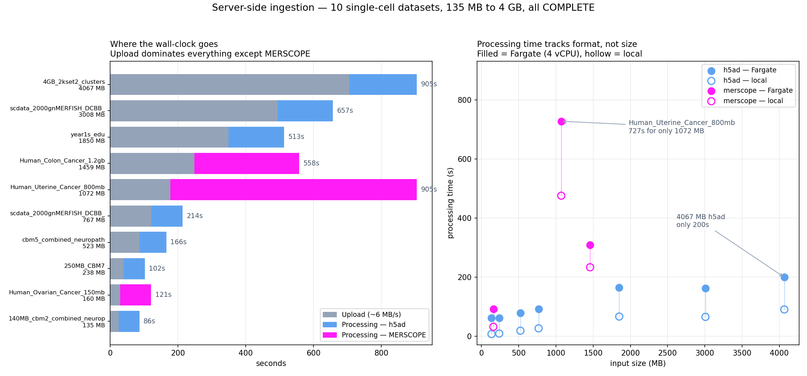

# Ingestion benchmark — single cell



All 10 single-cell test datasets (135 MB → 4 GB, h5ad + MERSCOPE) run twice: once
locally through `process_spatial_data.py`, once end-to-end through
ingest.merfisheyes.com (upload → S3 → AWS Batch → callback → viewer). **10/10
COMPLETE**, and every dataset's cell count, gene count, obs-column count,
DE-column count and per-gene chunk count matched between the two runs.

Measured 2026-07-24 on worker image `sha256:8066627e` (214 MB) and Batch job
definition rev 3 (4 vCPU / 16 GB, `DELETE_RAW=false`).

## What the numbers say

**Upload is the bottleneck, not processing.** A steady ~6 MB/s meant the 4 GB
dataset spent 673s uploading and 200s processing. Effort spent making the
processor faster is largely wasted; effort spent on upload throughput is not.

**Processing time tracks format, not size.** The 1 GB Uterine MERSCOPE took
727s; the 4 GB h5ad took 200s. MERSCOPE's CSV parsing dominates — the same
pattern held locally, so it is inherent to the format rather than an artefact of
Fargate.

**Fargate runs ~1.5–2× slower than local** on the same input (4 vCPU vs the
laptop's core count). Consistent across both formats, so local timings are a
usable lower bound when estimating.

**Memory**: the local pass peaked at 4.3 GB RSS on the 1.2 GB Colon MERSCOPE —
again MERSCOPE, not the largest h5ad. The job definition's 16 GB clears this
comfortably.

## Files

| file | what |
|---|---|
| `dataset-results.csv` | one row per dataset: sizes, counts, local vs e2e timings, dataset ids |
| `plot_results.py` | regenerates the chart from the CSV |
| `dataset-results.png` | the chart above |

Regenerate the chart with:

```bash
python3 docs/server-side-ingestion/benchmarks/plot_results.py
```

To re-measure the local half on a new batch of data, point the harness at a
folder — it discovers the datasets itself:

```bash
python3 scripts/test_datasets.py /path/to/datasets
```

## Caveats

- `dataset-results.csv` carries an extra row, `annotation_csv=yes`: the same
  cbm2 input re-run with a user-supplied cell-type CSV, which added 2 obs columns
  with palettes and DE stats. `plot_results.py` skips it so one input isn't
  plotted twice.
- Upload throughput is whatever the uploading machine's connection gives; ~6 MB/s
  here is not a property of the pipeline.
